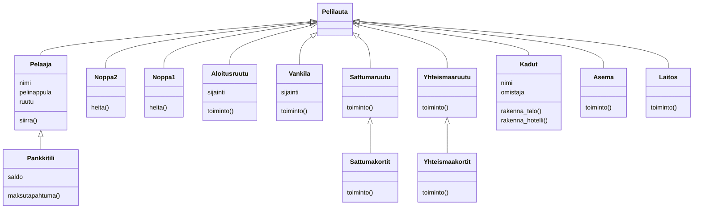

```mermaid

  classDiagram
    Pelilauta <|-- Pelaaja
    Pelilauta <|-- Noppa2
    Pelilauta <|-- Noppa1
    Pelilauta <|-- Aloitusruutu
    Pelilauta <|-- Vankila
    Pelilauta <|-- Sattumaruutu
    Pelilauta <|-- Yhteismaaruutu
    Pelilauta <|-- Kadut
    Pelilauta <|-- Asema
    Pelilauta <|-- Laitos
    Sattumaruutu <|-- Sattumakortit
    Yhteismaaruutu <|-- Yhteismaakortit
    Pelaaja <|-- Pankkitili

    class Pelaaja{
      nimi
      pelinappula
      siirra()
      ruutu

    }

    class Pelilauta{
           
    }

      class Noppa2{
        heita()
      }

      class Noppa1{      
        heita()
      }
      
      class Aloitusruutu{
        sijainti
        toiminto()
      }
      
      class Vankila{
        sijainti
        toiminto()
      }
      class Sattumaruutu{
      
      toiminto()
        
      }
      
      
      class Sattumakortit{
        toiminto()
      }
      
      class Yhteismaaruutu{
      
      toiminto()
        
      }
      
     
      
      class Yhteismaakortit{
        toiminto()
      }
      
      class Kadut{
        nimi
        omistaja
        rakenna_talo()
        rakenna_hotelli()
      }
      
      
      class Laitos{
      
      toiminto()
      
      }
      
      class Pankkitili{
        saldo
        maksutapahtuma()
      }
      
      
      class Asema{
      
      toiminto()
      
      }
```
