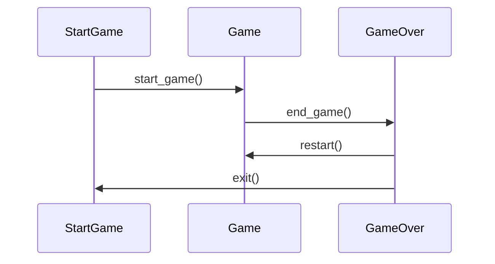

# Arkkitehtuurikuvaus

## Rakenne

Ohjelmassa on varsinainen koodi src tiedoston sisällä. Sprites sisältää erilaisten hahmojen kuten alustojen ja robot-hahmon toiminnallisuudet. Näiden hahmojen grafiikka haetaan assets tiedostosta. Nämä tiedostot sisältävät pelin toiminnalle tärkeitä luokkia, kuten GameLoop, Robot ja Level. 


## Käyttöliittymä

Ohjelmistossa on kolme käyttöliittymän näkymää:

* Pelin aloitus
* Pelikenttä
* Pelin lopetus



## Sovelluslogiikka

Sovelluslogiikka sisältää useita luokkia. Näistä tärkeimmät tällähetkellä ovat renderer sekä game_loop. Luokat pyörittävät peliä.


## Sekvenssikaavio

Sekvenssikaavio kuvaa robotin liikkumista kentällä


```mermaid
sequenceDiagram
Game ->> Robot: Start game
Game ->> Robot: Move robot left
Robot ->> Game: Update robot position on screen
Block ->> Game: Update block position on screen
Game ->> Robot: Move robot right
Robot ->> Game: Update robot position on screen
Block ->> Game: Update block position on screen
Game ->> Robot: End game
